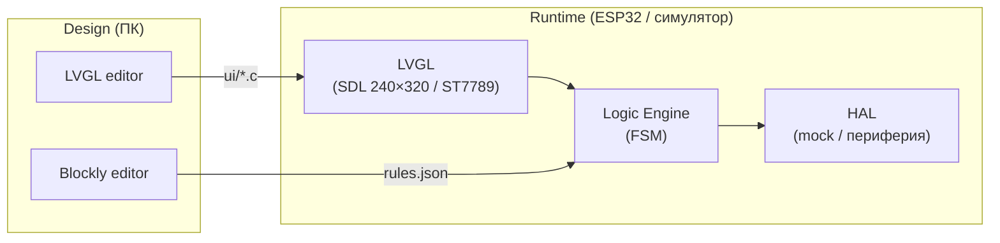

# lvgl_test

## Архитектура

UI — [PicoPixel](https://picopixel.io/) / [SquareLine](https://squareline.io/) (export → LVGL C), логика — `rules.json` (вручную или внешние инструменты, см. [editor/README.md](editor/README.md)).

На **ПК** — **симулятор** (LVGL + Logic Engine + HAL mock): те же `ui/*.c` и `rules.json`, разработка UI и бизнес-логики **без железа**.

На **ESP32** — прошивка **ESP-IDF**: Logic Engine (FSM) и HAL для реальной периферии.




### Симулятор (ПК)

Разработка и отладка без ESP32: общий код с прошивкой, подмена железа заглушками.


| Компонент        | В симуляторе          | На ESP32          |
| ---------------- | --------------------- | ----------------- |
| UI               | LVGL (SDL), 240×320   | LVGL → ST7789     |
| Logic Engine     | тот же `logic_engine` | тот же            |
| rules.json       | загрузка с диска      | LittleFS / embed  |
| Энкодер          | клавиши ↑↓ Enter      | EC11              |
| LoRa / GPS / NFC | mock + ручные события | реальные драйверы |


Структура репозитория: `common/` (код для всех платформ), `simulator/` (ПК), `editor/`, `firmware/` (ESP-IDF).

### Текущий этап

**Демо архитектуры:** Blockly → `rules.json` → Logic Engine → common UI → HAL (mock в симуляторе, ST7789 на ESP32).

Подробно: [docs/demo.md](docs/demo.md).

## Симулятор и редакторы

**Редакторы (внешние):** UI — [PicoPixel](https://picopixel.io/) или [SquareLine Studio](https://squareline.io/); логика — `common/rules/rules.json`. Подробно: [editor/README.md](editor/README.md).

**Симулятор (LVGL + SDL):**

```powershell
cd simulator
. .\activate-build.ps1
cmake -B build -G Ninja -DCMAKE_BUILD_TYPE=Release
cmake --build build
.\build\simulator.exe
```

См. [simulator/README.md](simulator/README.md) — если `cmake` не найден, нужен MinGW (`winget install BrechtSanders.WinLibs.POSIX.MSVCRT`).

## Сборка и прошивка

Требуется [ESP-IDF](https://docs.espressif.com/projects/esp-idf/) v5.2+.

**Windows (PowerShell):** перед `idf.py` активируйте окружение (в каждой новой сессии терминала):

```powershell
cd firmware
. .\activate-idf.ps1
idf.py set-target esp32
idf.py build
idf.py -p COM3 flash monitor
```

`activate-idf.ps1` обновляет PATH и вызывает `C:\esp\esp-idf\export.ps1`.

Вручную:

```powershell
Set-ExecutionPolicy -Scope CurrentUser RemoteSigned   # один раз, если export.ps1 блокируется
$env:Path = [System.Environment]::GetEnvironmentVariable("Path","Machine") + ";" + [System.Environment]::GetEnvironmentVariable("Path","User")
. C:\esp\esp-idf\export.ps1
```

**Если** `Python was not found`**:** перезапустите терминал после установки Python, либо выполните обновление PATH (строка выше). Отключите заглушки: *Параметры → Приложения → Дополнительные параметры приложения → Псевдонимы выполнения приложений* — выключить **python.exe** и **python3.exe** (Microsoft Store).

Либо откройте **ESP-IDF PowerShell** из меню Пуск — там `export.ps1` уже выполнен.

Windows: укажите COM-порт платы (Device Manager → Ports), например `COM3`.

Отладка дисплея: [firmware/docs/display_bringup.md](firmware/docs/display_bringup.md).

## Дисплей

Тестовая плата — **WEMOS LOLIN32 Lite** (ESP32). На время отладки к плате подключён **только дисплей** [ST7789V-IPS](https://atta.szlcsc.com/upload/public/pdf/source/231023/C17266248-824cb1ca90bae285eda83c99054d40ed.pdf) 2.4" · 240×320 · SPI · без тача.

Подключение по **4-wire SPI** (аппаратный SPI ESP32):


| Дисплей           | LOLIN32 Lite |
| ----------------- | ------------ |
| GND               | GND          |
| VCC               | 3.3 V        |
| LED (Backlight)   | GPIO 22      |
| RESET             | GPIO 16      |
| DC (Data/Command) | GPIO 17      |
| CS (Chip Select)  | GPIO 5       |
| SCK               | GPIO 18      |
| SDI (MOSI)        | GPIO 23      |
| SDO (MISO)        | GPIO 19      |


## Софт

- **UI:** [LVGL](https://github.com/lvgl/lvgl) 8.3 — embedded + PC-симулятор (SDL)
- **UI editor:** [PicoPixel](https://picopixel.io/) — design time
- **Logic:** `rules.json` (редактирование вручную или внешние инструменты — см. [editor/README.md](editor/README.md))
- **LoRa:** [libdriver/llcc68](https://github.com/libdriver/llcc68) — драйвер для MCU (в симуляторе — mock)


## Компоненты


| Наименование          | Модель                                                                                                                                                                                                                                                                                                    | Характеристики                                              |
| --------------------- | --------------------------------------------------------------------------------------------------------------------------------------------------------------------------------------------------------------------------------------------------------------------------------------------------------- | ----------------------------------------------------------- |
| Дисплей               | [ST7789V-IPS](https://atta.szlcsc.com/upload/public/pdf/source/231023/C17266248-824cb1ca90bae285eda83c99054d40ed.pdf) [(pdf)](https://dl.espressif.com/dl/schematics/LCD_ST7789.pdf) [(китай)](https://click.world.taobao.com/_b.cpupc)                                                                                                                             | 2.4" · IPS · ST7789 · SPI · 240×320 · FPC 18 pin · без тача |
| GPS                   | [ATGM332D-5N71](https://pese.oss-cn-shenzhen.aliyuncs.com/pdfs/1911211831_ZHONGKEWEI-ATGM332D_C458416.pdf) [(китай)](https://item.taobao.com/item.htm?id=669388277778&skuId=4886966828708)                                                                                                                | GPS + GLONASS · UART NMEA0183 · 2.7–3.6 V · 12.2×16 mm      |
| Микроконтроллер       | [ESP32](https://m5stack.oss-cn-shenzhen.aliyuncs.com/resource/docs/datasheet/core/esp32_datasheet_cn.pdf) [ESP32-S3](https://m5stack-doc.oss-cn-shenzhen.aliyuncs.com/472/esp32-s3_datasheet_cn.pdf) [ESP32-C6](https://www.espressif.com.cn/sites/default/files/documentation/esp32-c6_datasheet_cn.pdf) | Wi-Fi · BLE · ESP32-S3 / ESP32-C6 / ESP32                   |
| Аккумулятор резервный | [LiPo 150 mAh](https://atta.szlcsc.com/upload/public/pdf/source/20220914/ED735F4F9B1062A69980EE16902043DC.pdf)                                                                                                                                                                                            | LiPo 150 mAh                                                |
| Аккумулятор основной  | [LiPo 10000 mAh (146074)](https://atta.szlcsc.com/upload/public/pdf/source/20240508/57699078A8D750A37A92A5375737A576.pdf) [LiPo 2000 mAh (18650)](https://atta.szlcsc.com/upload/public/pdf/source/20180125/C165987_15168650465801302945.pdf)                                                             | LiPo 10000 mAh (146074) / LiPo 18650 2000 mAh               |
| LoRa                  | [LLCC68](https://atta.szlcsc.com/upload/public/pdf/source/20221229/96B0032DA4E361705241C07294BF0368.pdf) [(китай)](https://item.taobao.com/item.htm?id=916210411051)                                                                                                                                      | LLCC68 · 410–525 MHz · SPI · 22 dBm                         |
| Управление            | [EC11](https://atta.szlcsc.com/upload/public/pdf/source/20190109/C361167_8025A1363C62EF4BA37C0EA12E1AE3EA.pdf) [B3F](https://datasheet.lcsc.com/datasheet/C93157.pdf)                                                                                                                                     | энкодер · 1–2 кнопки                                        |
| NFC                   | [MFRC52202HN1](https://datasheet.lcsc.com/datasheet/pdf/4003bd6175b1d67870d9c9f9ebe671c6.pdf) [(китай)](https://item.taobao.com/item.htm?id=631022878377&skuId=4659695028435)                                                                                                                             | 13.56 MHz · ISO14443A / MIFARE · SPI / I²C / UART           |


